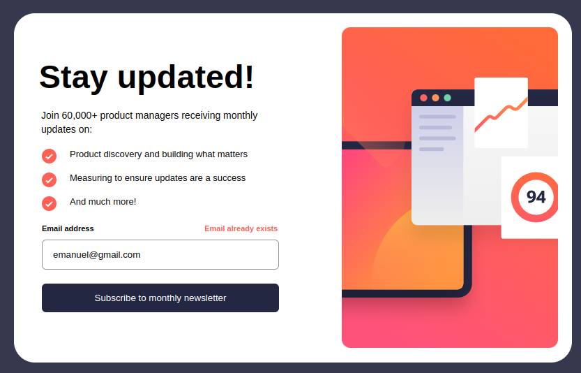
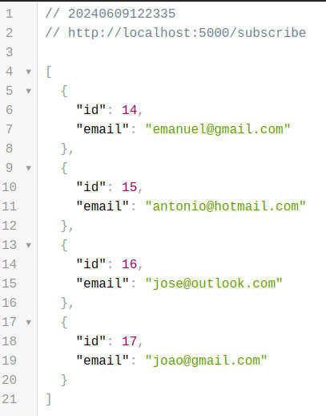
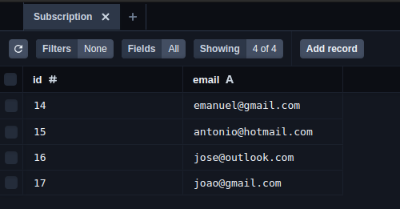

# Formulário de Boletim Informativo

Este é um projeto newsletter-signup inspirado no desafio do Frontend Mentor. O objetivo inicial era construir o formulário utilizando HTML, CSS e JavaScript. No entanto, decidi expandir o desafio utilizando React, TypeScript, Styled Components no front-end e uma API simples desenvolvida com Node.js e Prisma no back-end.

## 📸 Visualizações

### Tela Inicial


### Mensagem de Sucesso


### Validação de E-mail


### E-mail Already Exists 


## 🛠 Tecnologias Utilizadas

### Frontend
- **React**: Biblioteca JavaScript para construção de interfaces de usuário.
- **TypeScript**: Superset do JavaScript que adiciona tipagem estática ao código.
- **Styled Components**: Biblioteca para estilização de componentes em React.
- **Fetch API**: Para consumir a API do backend.

### Backend
- **Node.js**: Plataforma para execução de código JavaScript no servidor.
- **Fastify**: Framework web para Node.js focado em performance.
- **Prisma ORM**: ORM moderno e flexível para interagir com o banco de dados.

## 🚀 Funcionalidades

- **Adição de E-mail**: Usuários podem adicionar seu e-mail e enviar o formulário.
- **Mensagens de Sucesso e Validação**: Exibição de mensagens de sucesso e validação do formulário.
- **Design Responsivo**: Interface se adapta ao tamanho da tela do dispositivo.
- **Validações**:
  - O campo de e-mail não pode ficar vazio.
  - O e-mail deve estar em um formato válido.
  - Mensagem específica para e-mail já existente.

## 🚀 Como Iniciar

### Pré-requisitos

- Node.js instalado
- Gerenciador de pacotes npm ou yarn

### Instalando Dependências

#### Frontend

1. Navegue até a pasta `front`:

```bash
cd front
```

2. Instale as dependências:


```bash
npm install
```

#### Backend

1. No diretório back, inicie o servidor:

```bash
npm start
```

#### O servidor estará disponível em http://localhost:5000/subscribe.
 


#### Frontend

1. No diretório front, inicie a aplicação React:

```bash
npm run dev
```
#### A aplicação estará disponível em http://localhost:5173.

### Aplicação


#### Prisma - ORM

1. No diretório back, inicie a aplicação Prisma:

```bash
npx prisma studio
```

#### A aplicação estará disponível em http://localhost:5555.

